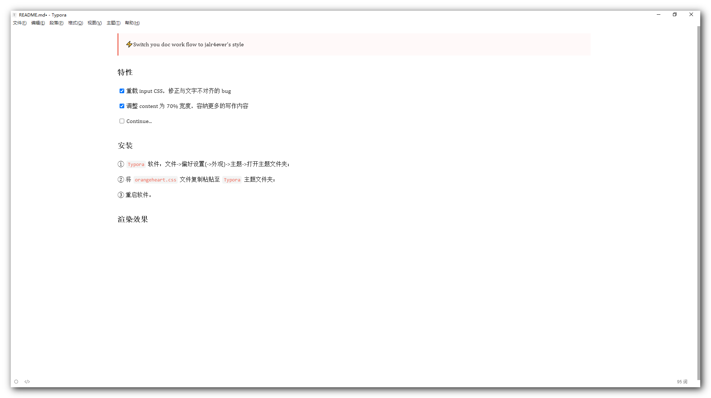

> ⚡Switch you doc work flow to jalr4ever's style 

# 特性

- [x] 重载 input CSS，修正与文字不对齐的 bug
- [x] 调整 content 为 70% 宽度，容纳更多的写作内容
- [ ] Continue...

# 安装

① `Typora` 软件：文件->偏好设置(->外观)->主题->打开主题文件夹；

② 将 `orangeheart.css` 文件复制粘贴至 `Typora` 主题文件夹；

③ 重启软件。

# 渲染效果

